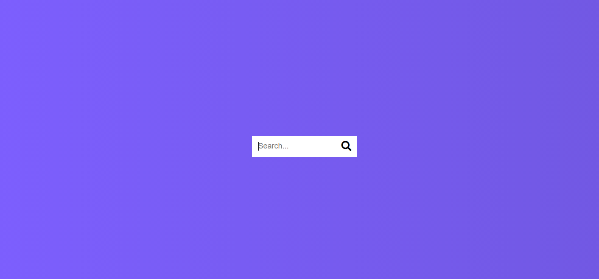

<h1 align=center> Hidden Search Widget 🔍 </h1>

**This is the day 4** and this project is about a hidden Search widget.

**Technologies used:**

✔️HTML
 
✔️CSS
 
✔️javaScript
 

**Tools:**

- Neo Vim

> This project forms part of "50 Projects In 50 Days" series.

You can see a live preview here: https://andres-condezo.github.io/hiddensearch/
